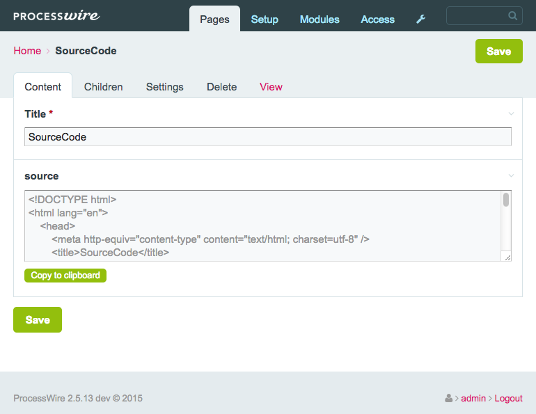

# Inputfield Page Source

Display a string with the rendered output of this Page (per it's Template) in an Inputfield. The markup could be copied with a button click (flash enabled browsers) and/or copied manually from the Inputfield. The rendered output is a runtime only value which is not stored in the database.

### Potential Use
Provide an easy way for editors to copy the sourcecode of the page for the use in newsletter services and such.

### Note !
This Inputfield should **not be used** in the page template directly. _(could give some “funky” results)_

